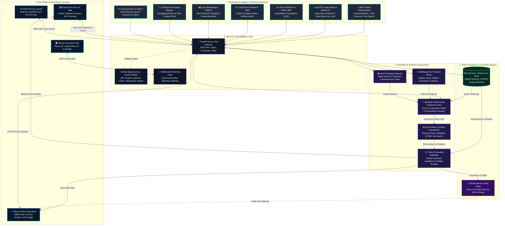

# RESQNET AI 🌊🚨
### AI-Powered Multi-Source Ocean & Coastal Disaster Intelligence, Verification, Risk Assessment, and Last-Mile Action Platform

<div align="center">

[](https://www.python.org/)
[](https://fastapi.tiangolo.com/)
[](https://react.dev/)
[](https://www.typescriptlang.org/)
[](https://vitejs.dev/)
[](https://tailwindcss.com/)
[](tests/)
[](LICENSE)

**[🌐 Interactive Live Architecture Diagram](https://resqnetai-arch.netlify.app/)** • **[🐙 GitHub Repository](https://github.com/codeCraft-Ritik/ResQnet-AI.git)** • **[📖 API Docs (Swagger)](http://localhost:8000/docs)** • **[🚀 Render Ready](render.yaml)**

> *"From scattered signals to trusted decisions."*

</div>

---

### 🇮🇳 Smart India Hackathon (SIH) Problem Specification
- **Problem Statement ID**: `SIH25039`
- **Title**: *Integrated Platform for Crowdsourced Ocean Hazard Reporting and Social Media Analytics*
- **Nodal Ministry / Organization**: Ministry of Earth Sciences (MoES)
- **Category**: Software | **Theme**: Disaster Management

---

## 1. Executive Summary & Problem Context

India features a **7,516 km coastline** inhabited by over **250 million citizens**, major commercial ports, and vulnerable coastal fishing villages. During tropical cyclones, extreme swell surges (*Kallakkadal*), and tsunami threats across the Bay of Bengal and Arabian Sea, emergency managers face three severe systemic challenges:

1. **Fragmented Data Silos**: MoES/IMD weather bulletins, INCOIS ocean wave buoys, ISRO MOSDAC INSAT-3DR satellite imagery, and citizen eyewitnesses operate in isolated silos.
2. **Noise and Rumor Bottlenecks**: Social media chatter contains massive misinformation, lack actionable GPS coordinates, and flood authorities with unverified reports.
3. **Black-Box AI Decision Traps**: Opaque machine learning algorithms deliver raw numbers without explaining *why* an evacuation is mandatory, *which* roads are impassable, or *which* shelters are safe.

**RESQNET AI** solves this through an end-to-end, explainable, and multi-source intelligence engine built on an **8-Stage Operational Disaster Lifecycle**:

$$\text{SENSE} \longrightarrow \text{EXTRACT} \longrightarrow \text{VERIFY} \longrightarrow \text{PREDICT} \longrightarrow \text{SIMULATE} \longrightarrow \text{DECIDE} \longrightarrow \text{ACT} \longrightarrow \text{LEARN}$$

Every decision is corroborated by independent physical evidence, bounded by **epistemic humility (max 98% confidence)**, decomposed through **TreeSHAP explainability**, and translated into **A\* hazard-avoiding evacuation routes** and zero-cost **Cell Broadcast (CBS) alerts**.

---

## 2. System Architecture

> ### 🌐 **Interactive Architecture Visualizer**
> Explore the live, interactive vector nodes, zoomable tiers, and operational data flows at:  
> 👉 **[https://resqnetai-arch.netlify.app/](https://resqnetai-arch.netlify.app/)**



---

## 3. The 8-Stage Disaster Response Pipeline

```
  [1. SENSE]       Continuous telemetry ingestion across 7 physical & social channels.
      │
  [2. EXTRACT]     Multilingual NLP parses Hindi, Hinglish, & English reports for victim counts & urgency.
      │
  [3. VERIFY]      Vision model verifies floodwaters; Bayesian cross-corroboration validates ground truth.
      │
  [4. PREDICT]     Ensemble risk model forecasts inundation depth, storm surge anomaly, and wind stress curl.
      │
  [5. SIMULATE]    Parametric stress-testing evaluates surge escalation (+0.5m to +3.5m) in real-time.
      │
  [6. DECIDE]      TreeSHAP identifies primary hazard drivers (wave surge vs rain vs tide) with 0-98% confidence.
      │
  [7. ACT]         A* pathfinder charts safer inland corridors to cyclone shelters; triggers zero-cost CBS SMS.
      │
  [8. LEARN]       Post-incident metrics record verification accuracy, response latency, and model feedback.
```

---

## 4. Key Subsystems & Technical Innovations

### 1. Bayesian Multi-Source Evidence Fusion
- **Methodology**: Weights independent evidence streams by sensor reliability coefficients:
  $$\text{Official IMD/INCOIS (0.95)} > \text{Ocean Buoy (0.90)} > \text{Satellite SAR (0.85)} > \text{Citizen Report (0.65)} > \text{News/GDELT (0.60)} > \text{Social Media (0.45)}$$
- **Contradiction Penalty**: Automatically dampens overall risk confidence if coastal buoys and inland sensors register opposing trends.
- **Epistemic Humility**: Confidence is rigorously capped at **98%** to acknowledge physical sensor uncertainty during extreme meteorological events.

### 2. Transparent Explainable AI (TreeSHAP)
- Decomposes every composite risk score into exact physical contributing factors:
  - **Wave Surge Height**: $+32\%$
  - **Sustained Wind Velocity**: $+24\%$
  - **Low Coastal Elevation**: $+20\%$
  - **Precipitation Influx**: $+16\%$
  - **Ground Citizen Eyewitnesses**: $+8\%$
- Generates plain-language operational summaries customized for **Incident Commanders**, **Field Responders**, and **Civilians**.

### 3. Hazard-Avoiding $A^*$ Safer Route Pathfinder
- Dynamic graph pathfinding engine ingesting active flood polygons, submerged coastal highways, and real-time shelter bed counts.
- Dynamically routes civilians around blocked coastal arteries (e.g. Puri Marine Drive) toward the nearest designated cyclone shelter with verified capacity.
- Generates one-click copyable SMS / WhatsApp text directions for zero-connectivity field dispatch.

### 4. Multilingual NLP Distress Parser
- Extracts disaster types, casualty counts, urgency ratings (1-5), and local landmarks.
- Supports native English, Hindi (Devanagari: `पानी भर गया`, `मदद चाहिए`), and Hinglish (`pani road pe aa gaya hai`).

### 5. Computer Vision Damage Inspector
- Classifies user-uploaded photos and satellite backscatter into structural damage levels (`MINOR`, `MODERATE`, `SEVERE`, `CRITICAL`).
- Instant client-side preview on report submission with automatic object and water intrusion detection.

### 6. Liquid Glass Tactical Command Console
- Built with React 18, Vite, and Tailwind CSS using an Aqua/Oceanic Liquid Glass design system.
- High-contrast night-vision UI tailored for Emergency Operations Centers (EOC).
- Real-time 6-KPI operations bar tracking Active Hazards, Critical Warnings, Available Shelter Beds, Exposed Population, Verification Latency (1.4s), and Consensus Confidence.

---

## 5. Comprehensive Directory Structure

```
ResQnet AI/
├── backend/                        # FastAPI REST API & WebSocket Engine
│   ├── __init__.py                 # Backend core package
│   ├── app.py                      # Application factory, CORS, SPA fallback & WSS gateway
│   ├── config.py                   # Pydantic v2 Settings, environment configuration
│   ├── database/                   # Data layer & schema models
│   │   ├── __init__.py             # Database package init
│   │   ├── schemas.py              # Pydantic request/response schemas & Enums
│   │   └── store.py                # In-memory Geo-Spatial DataStore & seed loader
│   └── routers/                    # Modular API route controllers
│       ├── __init__.py             # Router package exports
│       ├── alerts.py               # Official IMD vs AI vs Crowdsourced alert feeds
│       ├── auth.py                 # JWT Authentication & role demo credentials
│       ├── evidence.py             # Bayesian multi-source evidence fusion API
│       ├── hazards.py              # Active hazard polygons & INCOIS wind stress
│       ├── reports.py              # Crowdsourced report ingest & verification
│       ├── risk.py                 # SHAP XAI risk assessment & role action engine
│       ├── routes.py               # A* hazard-avoidance safer route generation
│       ├── shelters.py             # Shelter inventory, capacity, and coordinates
│       ├── simulation.py           # Parametric scenario simulator & pipeline
│       └── system.py               # Health probes, KPI analytics & CBS alerts
├── data/                           # Validated oceanographic datasets
│   ├── pilot_puri.json             # Comprehensive pilot baseline for Puri Coastal Zone
│   ├── incois_coastal_stations_clean.json # Cleaned INCOIS coastal station index
│   ├── incois_coastal_winds_clean.csv     # INCOIS surface wind time-series
│   ├── incois_ocean_wind_grid.json        # 200+ spatial wind vectors across Indian waters
│   └── incois_quickscat_daily_*.nc        # Raw NetCDF QuikSCAT scatterometer dataset
├── docker/
│   └── Dockerfile.backend          # Production container build specification
├── docs/                           # Technical documentation & guides
│   ├── CODEBASE_DOCUMENTATION.md   # Complete codebase reference guide
│   ├── WINDOWS_SETUP_GUIDE.md      # Windows setup, execution & troubleshooting
│   └── diagrams/
│       ├── index.html              # Standalone interactive vector diagram (Netlify)
│       └── candidate.json          # Node/edge vector graph coordinates
├── frontend/                       # React 18 + TypeScript + Vite Web Application
│   ├── public/                     # PWA manifest, service worker (sw.js), icons
│   ├── src/
│   │   ├── App.tsx                 # Root application layout, offline watcher & routes
│   │   ├── main.tsx                # React DOM entrypoint
│   │   ├── index.css               # Aqua Liquid-Glass design system & Tailwind
│   │   ├── components/             # Reusable UI component modules
│   │   │   ├── common/             # Badges, Skeletons, Role guidance banner
│   │   │   ├── evidence/           # EvidencePanel (Bayesian matrix table)
│   │   │   ├── hero/               # HeroGlobeVisual (interactive 3D globe)
│   │   │   ├── layout/             # Navbar, Footer, AuroraBackground
│   │   │   ├── map/                # DisasterMap (Leaflet), MapLayers, MapLegend
│   │   │   ├── ocean/              # OceanCard, WindStressCard (INCOIS QuikSCAT)
│   │   │   ├── reports/            # CitizenReportForm (AI pre-check), ReportCard
│   │   │   ├── risk/               # RiskCard, XAIPanel, RiskBreakdown, AnalyticsChart
│   │   │   ├── routes/             # SaferRouteCard (A* pathfinding UI)
│   │   │   ├── search/             # LocationSearch, SearchModal (20+ Indian ports)
│   │   │   ├── simulation/         # ScenarioSimulator (sliders), PipelineModal
│   │   │   └── weather/            # WeatherCard, CityForecastCard, SatelliteModal
│   │   ├── pages/                  # Top-level view controllers
│   │   │   ├── LandingPage.tsx     # Hero showcase & executive overview
│   │   │   ├── LocationIntelligencePage.tsx # Deep-dive for 20+ coastal ports
│   │   │   ├── LiveMapPage.tsx     # Fullscreen tactical GIS command map
│   │   │   ├── CommandCenterPage.tsx # Authority/NDRF 6-KPI operations console
│   │   │   ├── CitizenReportingPage.tsx # Crowdsourced report feed & submission
│   │   │   ├── SimulationPage.tsx  # Parametric crisis stress-testing studio
│   │   │   ├── AlertsPage.tsx      # Unified Official vs AI vs Citizen alerts
│   │   │   └── NotFoundPage.tsx    # 404 handler
│   │   ├── services/               # Typed API client services
│   │   └── types/                  # TypeScript interfaces (disaster, imd, risk, route)
│   ├── package.json                # Frontend dependencies & build scripts
│   ├── tailwind.config.js          # Custom Liquid Glass theme, glow shadows & hues
│   └── vite.config.ts              # Proxy rules, vendor chunking & build settings
├── ingestion/                      # Multi-source data providers & connectors
│   ├── base.py                     # Abstract BaseProvider with fetch/normalize/health
│   └── providers/                  # Specialized agency adapters
│       ├── copernicus.py           # Sentinel-1 SAR water inundation provider
│       ├── gdelt.py                # Global news intelligence provider
│       ├── imd.py                  # IMD Coastal Bulletin & 7-Day City Forecast
│       ├── incois.py               # INCOIS Buoy (BOB-04) & ocean state provider
│       ├── incois_wind.py          # INCOIS QuikSCAT Scatterometer surface wind provider
│       ├── mosdac.py               # ISRO MOSDAC INSAT-3DR QPE satellite provider
│       ├── osm.py                  # OpenStreetMap road topology & GEBCO elevation
│       └── social.py               # Public social media hazard signal provider
├── ml/                             # Machine Learning & Analytical Subsystems
│   ├── evaluation/metrics.py       # Precision, Recall, F1, and MAE benchmarks
│   ├── explainability/xai_engine.py# TreeSHAP feature attribution & local rationale
│   ├── fusion/evidence_fusion.py   # Multi-source Bayesian consensus matrix
│   ├── nlp/multilingual_parser.py  # Regex & transformer zero-shot distress parser
│   ├── risk/risk_model.py          # Interpretable physical-bounds risk ensemble
│   ├── routing/safe_route_engine.py# Dynamic A* hazard-avoidance pathfinder
│   └── vision/damage_inspector.py  # Computer vision photo damage triage
├── scripts/
│   └── clean_incois_dataset.py     # Parser for raw INCOIS NetCDF ocean wind data
├── tests/                          # Automated test suite (pytest)
│   ├── test_api.py                 # FastAPI route & schema validation tests
│   ├── test_fusion.py              # Evidence fusion math & contradiction tests
│   ├── test_nlp.py                 # Multilingual NLP accuracy & entity tests
│   └── test_routing.py             # A* hazard perimeter avoidance tests
├── .env.example                    # Template environment variables
├── .gitignore                      # Git exclusion rules
├── docker-compose.yml              # Multi-container orchestration definition
├── render.yaml                     # 1-Click Render Cloud deployment blueprint
├── requirements.txt                # Python backend dependencies
└── run.py                          # Unified single-command launcher script
```

---

## 6. Getting Started (Installation & Execution)

### Prerequisites
- **Python**: Version `3.10`, `3.11`, or `3.12` installed.
- **Node.js**: Version `18+` and `npm` installed.
- **Git**: Installed.

---

### Step 1: Clone the Repository
```bash
git clone https://github.com/codeCraft-Ritik/ResQnet-AI.git
cd ResQnet-AI
```

---

### Step 2: Set Up Backend (Python)
```bash
# Windows (PowerShell)
python -m venv venv
.\venv\Scripts\Activate.ps1

# Linux / macOS
python3 -m venv venv
source venv/bin/activate

# Install dependencies
pip install -r requirements.txt

# Copy environment configuration
cp .env.example .env
```

---

### Step 3: Set Up Frontend (React + Vite)
```bash
cd frontend
npm install
npm run build
cd ..
```
*(Building compiles the frontend into `frontend/dist`. The FastAPI server serves the web application and API on a single unified port).*

---

### Step 4: Run the Platform (Single Command)
```bash
python run.py
```

The system will start and provide instant access:
- 🚀 **Tactical Command Center Web App**: [http://localhost:8000/](http://localhost:8000/)
- 📚 **Interactive Swagger / OpenAPI Documentation**: [http://localhost:8000/docs](http://localhost:8000/docs)
- 🧭 **Alternative Redoc API Explorer**: [http://localhost:8000/redoc](http://localhost:8000/redoc)
- 📡 **Live WebSocket Telemetry Gateway**: `ws://localhost:8000/ws/live-feed`

---

## 7. Frontend Development Mode (Hot-Reloading)

To develop with instant Vite hot-module replacement (HMR):

1. **Terminal 1 (Backend)**:
   ```bash
   python run.py
   ```
2. **Terminal 2 (Frontend Dev Server)**:
   ```bash
   cd frontend
   npm run dev
   ```
3. Open [http://localhost:5173/](http://localhost:5173/). Vite is pre-configured to proxy all `/api/*` and `/ws/*` calls to FastAPI on `127.0.0.1:8000`.

---

## 8. 1-Click Cloud Deployment to Render

The repository includes a ready-to-deploy [`render.yaml`](render.yaml) specification:

1. Push your repository to GitHub.
2. In [Render Dashboard](https://dashboard.render.com/), click **New +** ➔ **Blueprint** (or **Web Service**).
3. Select your repository.
4. Render will configure everything automatically:
   - **Environment**: `Python`
   - **Build Command**: `pip install -r requirements.txt && cd frontend && npm install && npm run build && cd ..`
   - **Start Command**: `python run.py`
   - **Health Check Path**: `/api/health`

---

## 9. Major API Endpoints

| Category | Method | Endpoint | Description |
| :--- | :--- | :--- | :--- |
| **System** | `GET` | `/api/health` | Root health check and operational mode status. |
| **System** | `GET` | `/api/v1/system/health` | Live availability check for all 7 ingestion providers. |
| **System** | `GET` | `/api/v1/system/analytics` | District-level operational KPI summary. |
| **System** | `POST` | `/api/v1/system/dispatch-alert` | Zero-cost Cell Broadcast (CBS) emergency alert trigger. |
| **Hazards** | `GET` | `/api/v1/hazards` | Active hazard polygons (supports `?location=` filtering). |
| **Hazards** | `GET` | `/api/v1/hazards/incois/wind-stress` | INCOIS QuikSCAT scatterometer wind stress & curl. |
| **Hazards** | `GET` | `/api/v1/hazards/imd/coastal-bulletin`| Official IMD coastal bulletin text and warnings. |
| **Hazards** | `GET` | `/api/v1/hazards/imd/city-forecast` | Official IMD 7-day city weather forecast. |
| **Reports** | `GET` | `/api/v1/reports` | List crowdsourced citizen reports with status filters. |
| **Reports** | `POST` | `/api/v1/reports` | Submit a citizen report with automatic AI verification. |
| **Reports** | `POST` | `/api/v1/reports/analyze-preview` | Real-time multilingual NLP and photo damage pre-check. |
| **Evidence**| `GET` | `/api/v1/evidence/{hazard_id}` | Complete Bayesian evidence matrix & confidence breakdown. |
| **Risk** | `GET` | `/api/v1/risk/assess` | SHAP-style factor attribution decomposition. |
| **Risk** | `GET` | `/api/v1/risk/role-action` | Safety-first action directives by user role. |
| **Routes** | `POST` | `/api/v1/routes/safer` | Dynamic A* hazard-avoidance shelter pathfinding. |
| **Shelters**| `GET` | `/api/v1/shelters` | Relief shelter capacities and operational status. |
| **Simulation**| `POST` | `/api/v1/simulation/run` | Parametric surge crisis stress-testing. |
| **Simulation**| `POST` | `/api/v1/simulation/execute-pipeline-demo` | Automated 8-stage disaster response lifecycle demo. |

---

## 10. Role-Based Access Control (RBAC)

The platform provides tailored interfaces and permission scopes for four operational profiles:

| Role | Target User | Interface & Permissions |
| :--- | :--- | :--- |
| **Authority** (`AUTHORITY`) | NDRF, ODRAF, District Magistrates | Full Command Center HUD, 6-KPI metrics, CBS dispatch trigger, shelter activation. |
| **Citizen** (`CITIZEN`) | Coastal Residents, Fisherfolk | Offline-ready SOS, crowdsourced reporting form, nearest shelter route guidance. |
| **Responder** (`RESPONDER`) | Field Rescue Battalions, Coast Guard | Tactical hazard perimeters, vehicle impassability overlays, live report triage. |
| **Analyst** (`ANALYST`) | Ocean Modelers, Meteorologists | Raw INCOIS QuikSCAT scatterometer data, SHAP waterfall charts, simulation studio. |

*Quick test demo accounts (Password: `password123`):*
- `authority@resqnet.gov.in`
- `citizen@resqnet.gov.in`
- `responder@resqnet.gov.in`
- `analyst@resqnet.gov.in`

---

## 11. Automated Testing & Quality Assurance

The codebase includes comprehensive unit and integration tests covering API schemas, Bayesian math, NLP parsing, and A* pathfinding:

```bash
# Run pytest test suite
python -m pytest
```

```text
tests\test_api.py ..............                                         [ 70%]
tests\test_fusion.py ..                                                  [ 80%]
tests\test_nlp.py ...                                                    [ 95%]
tests\test_routing.py .                                                  [100%]
============================== 20 passed in 0.48s ==============================
```

```bash
# Verify frontend production build
cd frontend
npm run build
```

```text
✓ 2772 modules transformed.
dist/index.html                   1.90 kB │ gzip:   0.82 kB
dist/assets/index-OS29SHxK.css   75.38 kB │ gzip:  17.12 kB
dist/assets/index-C0anW72h.js   231.64 kB │ gzip:  53.52 kB
✓ built in 5.37s
```

---

## 12. Responsible AI & Operational Ethics

1. **Strict Data Lineage**: Official Government Warnings (IMD/INCOIS) are displayed with statutory precedence. Automated machine outputs are explicitly badged as *"AI Risk Assessment — Predictive Intelligence"* to prevent public confusion.
2. **Epistemic Humility**: AI confidence scores are capped at **98%** to prevent over-reliance on automated models during extreme meteorological anomalies.
3. **No False Safety Guarantees**: Evacuation paths avoid known flooded polygons but provide explicit disclaimers directing citizens to obey local law enforcement sirens.
4. **Privacy Protection**: Public crowdsourced feeds omit personal citizen phone numbers and blur sensitive residential coordinates.

---

## 13. License

This project is licensed under the terms of the **MIT License**. See [LICENSE](LICENSE) for details.

---

<div align="center">

**Built with pride for coastal community resilience & disaster safety across India.**  
*Developed for Smart India Hackathon (SIH 2025) • Ministry of Earth Sciences (MoES)*

</div>
